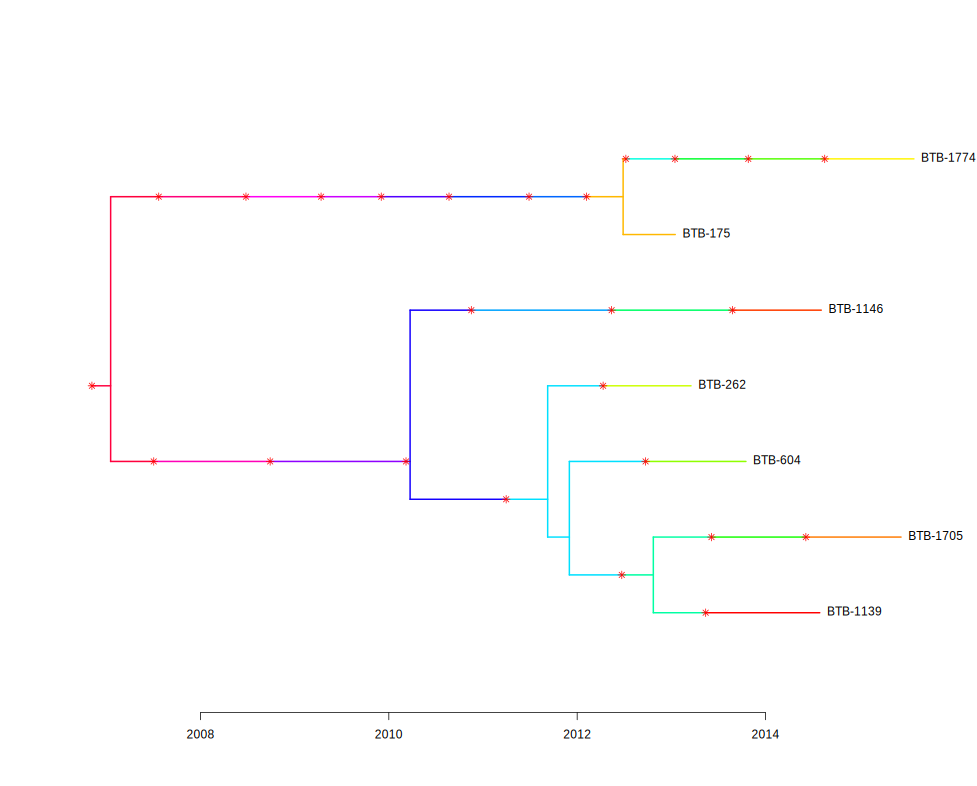
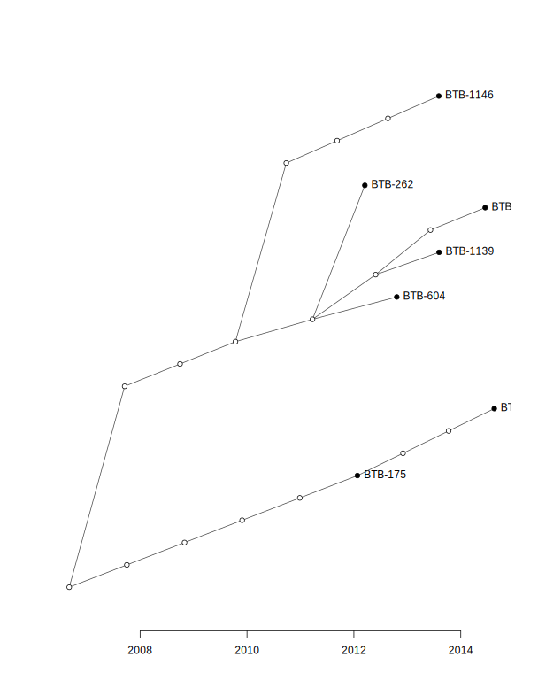

# Introduction

This vignette will walk you through the process of using the `beast2tpPipeline` package to create SNP clusters
from a set of fasta files, create xml files for each cluster, run BEAST2, run TransPhylo on the BEAST2 results,
and then do some kind of regression on the probabilities assigned by TransPhylo.

After running BEAST2, we have a set of posterior trees for each cluster. With this package we can do two things:

1. **Create a [maximum clade credibility (MCC) tree](https://en.wikipedia.org/wiki/Maximum_clade_credibility_tree#:~:text=A%20maximum%20clade%20credibility%20tree,of%20the%20sampled%20posterior%20trees.0)
from the posterior trees, and run TransPhylo multitree on the MCC trees, sharing some parameters that can be
simultaneously estimated**. The MCC tree is a single tree that attempts to summarize the posterior trees, like a
mean or median when posterior samples are values from the real line. With this method we take one tree that
summarizes the posterior trees for each cluster, and run TransPhylo on all of them as if they are the true 
phylogenetic trees.
2. **Subsample some number of trees from the BEAST2 posterior tree samples for each cluster, and run TransPhylo
on a sample of trees for each cluster, rather than one summary tree**. This has the advantage of accounting for
some of the phylogenetic uncertainty in the BEAST2 trees, rather than assuming that one tree is the truth. 
However, it is computationally more expensive: instead of one TransPhylo run on all the clusters, we have to
run TransPhylo on each cluster separately, each time with a decently-sized set of trees. This should be run
on a computing cluster. Additionally, via this method, parameter sharing is not possible.

In this vignette, we will use this package to do (1). For the vignette on (2), see Using the BEAST2 - TransPhylo Pipeline with a Sample of BEAST2 Iterations (Posterior Trees).

First, load the package with `library`.

```{r setup}
library(beast2tpPipeline)
```

# Data for this Example

This package comes with data collected from the Kopanyo study, in which tuberculosis (TB) samples were collected
in two regions of Botswana, a country with high prevalence of both TB and human immodeficiency virus (HIV). Read
more about the study [here](https://bmjopen.bmj.com/content/6/5/e010046).

These data contain 4 fasta files, one for each lineage of TB. Each fasta file contains aligned TB sequences from
study participants. There is also metadata available for these samples, including things like HIV status, age,
gender, sample collection date, and a handful of other variables.

Suppose we are interested in using these TB sequences to draw inference on whether having HIV makes an individual
more likely to transmit TB to someone else.

# Creating Single Nucleotide Polymorphism (SNP) Clusters

First, read the fasta files and the metadata into `R`.

```{r read_data}
fasta_files <- list.files(system.file("kopanyo", package = "beast2tpPipeline"),
                          pattern = ".fasta", full.names = TRUE)
tb_sequences <- lapply(fasta_files, ape::read.dna, format = "fasta",
                       as.character = TRUE)

metadata <- list.files(system.file("kopanyo", package = "beast2tpPipeline"),
                       pattern = ".csv", full.names = TRUE)
metadata <- read.csv(metadata)
``` 

We can take a peek at the data:

```{r data_preview}
head(metadata)

dim(metadata)
```

Notice that we have 1426 sequences and corresponding metadata. It would be very computationally intensive to run BEAST2 on all of these sequences
simultaneously. Instead, we will create clusters of similar sequences and run BEAST2 on each cluster separately. To create clusters, we will use 
SNP thresholding.

SNPs are single nucleotide polymorphisms, which are single base pair differences between sequences. We can use these differences to group sequences
into clusters that are more likely to be closely related to each other. We will use the `transcluster` package to do this. `transcluster` is a package
developed alongside the paper [Beyond the SNP Threshold: Identifying Outbreak Clusters Using Inferred Transmissions](https://academic.oup.com/mbe/article/36/3/587/5300248).
It was built to handle both plain SNP thresholding to create clusters, and also clustering based on likely transmissions. Here we will use the former,
as it is simpler and more commonly used, but the latter is still available in the function.

To assign sequences to their clusters based on SNPs, we will use `assign_snp_clusters`, which is a wrapper around some `transcluster` functions.

```{r assign_clusters, eval = F}
# Get collection dates by lineage
collectdts <- split(metadata, metadata$Lineage)
# Create named vectors of dates, as required by the function
collectdts <- lapply(collectdts, function(meta) {
  dates <- meta$collectdt
  names(dates) <- meta$SampleID
  dates
})

# Apply the function to each lineage of sequences
cluster_assignments <- mapply(assign_snp_clusters,
                              # `seqs` is a matrix of sequences
                              seqs = tb_sequences,
                              # `collectdts` is a named list of vectors of collection dates
                              # where the elements are collection dates and the names are sample IDs  
                              collectdts = collectdts,
                              threshold = 5,
                              SIMPLIFY = FALSE)
```

```{r cluster_assignments_saved, echo = F}
# Get collection dates by lineage
collectdts <- split(metadata, metadata$Lineage)
# Create named vectors of dates, as required by the function
collectdts <- lapply(collectdts, function(meta) {
  dates <- meta$collectdt
  names(dates) <- meta$SampleID
  dates
})

snp_dist <- readRDS(system.file("mcc_trees_example", "snp_dist_matrices.rds",
                                package = "beast2tpPipeline"))

# Apply the function to each lineage of sequences
cluster_assignments <- mapply(assign_snp_clusters,
                              snp_matrix = snp_dist,
                              collectdts = collectdts,
                              threshold = 5,
                              SIMPLIFY = FALSE)
```

Computing the distance matrix for large clusters can take time, so if you already have a distance matrix
saved, you can pass it to `assign_snp_clusters` with the `dist_matrix` argument.

Now we have:

```{r cluster_assignments_preview}
# Rename clusters to include lineage
cluster_assignments <- lapply(seq_along(cluster_assignments), function(i) {
  cluster_assignments[[i]]$cluster_name <- paste0("lineage", i, "_", cluster_assignments[[i]]$cluster_name)
  cluster_assignments[[i]]
})

# Take a look at the cluster assignments
lapply(cluster_assignments, head)
```

Next, we will create the actual BEAST2 clusters using the `create_BEAST2_clusters` function. We will take
the sequences, split them into separate objects, and keep only the SNPs (sites that are the same
across all sequences will not matter to BEAST2).

We will discard clusters with fewer than 4 sequences, and clusters with fewer than 8 SNPs. We also add
constant sites to the sequences, to deal with ascertainment bias in BEAST2 due to the fact that we are only keeping
the SNPs.


```{r create_clusters}
# For each lineage, use the cluster assignments to put the sequences
# into clusters
snp_matrices <- lapply(seq_along(tb_sequences), function(lineage_index) {
  # Pull the sequences and cluster assignments for this lineage
  tb_seq_lineage <- tb_sequences[[lineage_index]]
  cluster_assignments_lineage <- cluster_assignments[[lineage_index]]
  create_BEAST2_clusters(seqs = tb_seq_lineage,
                         cluster_assignments = cluster_assignments_lineage,
                         min_cluster_size = 4,
                         min_varsites = 8,
                         snps_only = TRUE,
                         constant_sites = "acgt")
})

# Take a look at the clusters from the first lineage
snp_matrices[[1]]
``` 

The output of this function is a list of matrices, where each matrix is a cluster of sequences. We will use these
to write into the xml file to run BEAST2. If you are not using the template xml file available with this package,
you should save these sequences as fasta files to be loaded into BEAUti, which you can do by providing a `fasta_dir`
argument to the above function.

After running the above chunks, we have two objects: `cluster_assignments`, a list of lineages each containing
a dataframe giving sample IDs, cluster names, and collection dates; and `snp_matrices`, a list of lineages each
containing a list of matrices, where each matrix is a cluster of sequences.

# Creating XML Files for BEAST2

For each cluster, we will create an xml file for BEAST2. In general, BEAUti is used to create xml files for BEAST2, but here we are using a 
model that should be mostly the same across all clusters. For the TB data, this package comes with a template xml and the function
`create_cluster_xml` that will fill in the necessary information for each cluster. The model associated with this xml template:

- Strict clock model
- HKY substitution model
- Coalescent constant population tree prior
- Uniform clock rate prior, user-supplied bounds
- Log-normal(1, 1.25) (w/ upper bound of 1) frequency parameter
- Log-normal(1, 1.25) transition-transversion parameter for HKY (kappa)
- Log-normal(1, 1.25) coalescent population size parameter

The function to create the xml files requires the sequences (SNPs, for us) for the cluster, the name of the cluster,
the sampling dates for the sequences in the cluster, and a directory to output the xml files to. 

```{r write_xml, eval = F}
# For each lineage, write the xml files for all clusters
invisible(lapply(seq_along(snp_matrices), function(lineage_index) {
  # Get list of clusters for the lineage
  lineage_seqs <- snp_matrices[[lineage_index]]
  # Get cluster assignments data frame for the lineage
  cluster_assignments_lineage <- cluster_assignments[[lineage_index]]
  create_xml_files(seqs_list = lineage_seqs,
                   cluster_assignments = cluster_assignments_lineage,
                   out_dir = system.file("mcc_trees_example", "BEAST2",
                                         package = "beast2tpPipeline"))
}))

```

The function above does not return anything, but it writes xml files to the directory specified in `out_dir`. Messages
are printed when each xml file is written.

# Running BEAST2

Next, we will run BEAST2 on the xml files we just created. We will use the `run_beast2` function, which calls
command-line BEAST2 using `system`. You may need to change the `beast2_path` argument depending on which version
of BEAST2 you have installed and where it is installed to.

Below I have parallelized the code using the `parallel` package. This is not necessary, but it can speed
up the process if you have multiple cores available. Note that this will not work on Windows, but there are
other ways to parallelize on Windows machines.

```{r run beast2, eval = F}
cores <- parallel::detectCores() / 2
input_xml <- list.files(system.file("mcc_trees_example", "BEAST2",
                                    package = "beast2tpPipeline"),
                        pattern = "\\.xml", full.names = TRUE)
invisible(parallel::mclapply(input_xml, run_beast2, mc.cores = cores))
```

After running BEAST2, for each cluster, we will have a log file and a tree file. The log file logs the MCMC
sampling process, and the tree file contains the posterior trees. First, as a quick check for the mixing
of the MCMC, we can make sure the effective sample size (ESS) is above 200 for all parameters. We can do this 
using the `ess_checks` function, which calls on the package `tracerer`.

```{r check_beast2_mixing}
beast_logs <- list.files(system.file("mcc_trees_example", "BEAST2",
                                     package = "beast2tpPipeline"),
                         pattern = "\\.log", full.names = TRUE)
invisible(sapply(beast_logs, function(log) {
  ess_checks("BEAST2", log, min_ess = 200)
}))
```

If the ESS is too low, you may want to consider re-running BEAST2 with more iterations. Be sure also to look at traceplots
of the MCMC run, which is easiest to do with `Tracer`.

# Creating Maximum Clade Credibility Trees

Next, we will create a maximum clade credibility (MCC) tree from the posterior trees. The MCC tree is a single tree that
attempts to summarize the posterior trees, like a mean or median when posterior samples are values from the real line. We will
use the `get_mcctree` function for this. `get_mcctree` calls command-line TreeAnnotator from the BEAST2 suite, so you may need
to change the `treeannotator_path` argument depending on where TreeAnnotator is installed.

```{r get_mcc_trees, eval = F}
trees_files <- list.files(system.file("mcc_trees_example", "BEAST2",
                                      package = "beast2tpPipeline"),
                          pattern = ".trees", full.names = TRUE)
out_dir <- system.file("mcc_trees_example", "BEAST2", "mcctree",
                       package = "beast2tpPipeline")
invisible(parallel::mclapply(seq_along(trees_files), function(i) {
  get_mcctree(input_treesfile = trees_files[i], output_dir = out_dir)
}, mc.cores = cores))
```

This function outputs nothing, but MCC trees are saved to the specified output directory.

The MCC trees look like this, for example:

```{r mcc_tree_preview, echo = F, warning = F, message = F}
library(treeio)
library(ggtree)
library(ggplot2)
mcc_tree_ex <- system.file("mcc_trees_example", "BEAST2", "mcctree",
                           "mcctree-lineage4_cluster376.nexus",
                           package = "beast2tpPipeline")
beast <- read.beast(mcc_tree_ex)
tip_dates <- cluster_assignments[[4]][cluster_assignments[[4]]$cluster_name == "lineage4_cluster376", c("sample_id", "collectdt")]
youngest_tip_date <- max(lubridate::decimal_date(as.Date(tip_dates[, 2])))
youngest_tip_height <- max(beast@data$height)
root_date <- 0  - youngest_tip_height + youngest_tip_date

# Get same colors as phylomap, sort them
custom_palette <- colorRampPalette(c("#580999", "#d98600"))(23)
tip_labels <- beast@phylo$tip.label
is_tip <- beast@phylo$edge[, 2] <= length(beast@phylo$tip.label)
ordered_tips <- beast@phylo$edge[is_tip, 2]
sorted_tip_labels <- beast@phylo$tip.label[ordered_tips]
named_colors <- setNames(custom_palette, sorted_tip_labels)

# Plot with ggtree
ggtree(beast, ladderize = FALSE) +
  geom_range(range = 'height_0.95_HPD', color = 'slategray', alpha = .6, size = 2, center = "height") +
  geom_tiplab(aes(color = label), align = TRUE, linesize = 0.5, linetype = "dashed", offset = 0.3) +
  theme_tree2() +
  scale_color_manual(values = named_colors) +
  theme(legend.position = "none",
        plot.title = element_text(size = 20),
    axis.title = element_text(size = 16),
    axis.text = element_text(size = 14)) +
  xlab("Date") +
  scale_x_continuous(labels = function(x) floor(x + round(root_date, 2)), limits = c(-6, 7.5),
                     breaks = seq(-6, 6, by = 2)) +
  ggtitle("Lineage 4, Cluster 376 MCC Tree")
```

where there are associated error bars for each node and uncertainty in the tree topology, but this will not be accounted
for by TransPhylo.

# Running TransPhylo on the MCC Trees

Now that we have the MCC trees, we can run TransPhylo on them. TransPhylo is a package that tries to infer the
"who infected whom" tree, or transmission tree, taking the phylogenetic tree as data. In reality, there is uncertainty
in the phylogenetic tree, but TransPhylo does not account for this.

We will use the `run_TransPhylo` function to run TransPhylo on the MCC trees. We first read in the MCC trees we created
above, make sure their names match the names in the cluster assignments data frame (BEAST2 does some slight renaming of
its outputs automatically), and then run TransPhylo. We can run TransPhylo on all of the trees at once, sharing a couple
of parameters that are common across the trees and can be estimated simultaneously.

```{r run_transphylo, eval = F}
# Read the trees and manipulate the names to make sure they match
# the names in cluster_assignments
mcc_trees_files <- list.files(system.file("mcc_trees_example",
                                          "BEAST2", "mcctree",
                                          package = "beast2tpPipeline"),
                              pattern = ".tree", full.names = TRUE)
mcc_trees <- lapply(mcc_trees_files, ape::read.nexus)
names(mcc_trees) <- gsub(".nexus", "", basename(mcc_trees_files))
names(mcc_trees) <- gsub(".*-", "", names(mcc_trees))
# Want to run trees from all lineages together, so paste the cluster
# assignments list of dataframes into one dataframe
all_cluster_assignments <- do.call(rbind, cluster_assignments)
# Run TransPhylo on the MCC trees
prob_source <- run_TransPhylo(mcc_trees,
                              type = "mcctrees",
                              cluster_dict = all_cluster_assignments,
                              out_dir = system.file("mcc_trees_example",
                                                    "TransPhylo",
                                                    package = "beast2tpPipeline"),
                              w.shape = 10,
                              w.scale = 0.1,
                              prior_pi_a = 1,
                              prior_pi_b = 19,
                              share = c("neg", "off.r"),
                              startNeg = 1.48,
                              mcmcIterations = 100000)
```

This function outputs a data frame containing each sample ID and the probability of that sample being an infection source,
i.e., the probability that they infected someone else with TB. It also saves the TransPhylo results (the `resTransPhylo`
object output by `TransPhylo::infer_multittree_share_param`) as an `.rds` file in the specified output directory.

We can also use the `ess_checks` function to check the mixing of the TransPhylo run, but it is probably more useful
to look at the traceplots for estimated parameters. Below is an example of how to do this, using a TransPhylo function
with only the first cluster.

```{r traceplots, eval = F}
transphylo_res <- readRDS(transphylo_res_file)
TransPhylo::plotTraces(transphylo_res[[1]])
```

```{r include_traceplot_image, echo = F}
knitr::include_graphics("images/example_traceplots.svg")
```

TransPhylo also provides methods of summarizing the posterior trees, and plotting the result. For example,
we can get the "medoid" (extension of median) tree and plot it. Here, the phylogenetic tree is plotted
with colors, where each color represents an individual and asterisks represent transmission events. In TransPhylo
this object is called a `ctree`, or combined phylogenetic/transmission tree ("colored tree").

```{r plot_transphylo, eval = F}
medoid <- TransPhylo::medTTree(transphylo_res[[1]])
TransPhylo::plotCTree(medoid)
```

```{r include_medttree_image, echo = F}

```

There is also a "consensus" tree, which is built by combining clades occurring in at least some fraction
of the posterior samples. This tree will not necessarily be a tree that is in the posterior samples. It
can be plotted with `plot`. In TransPhylo this object is called a `ttree`, or transmission tree.

```{r plot_transphylo_consensus, eval = F}
cons <- TransPhylo::consTTree(transphylo_res[[1]])
plot(cons)
```

```{r include_consttree_image, echo = F}

```

We may also be interested in looking at the distribution of the probabilities assigned by TransPhylo:
```{r prob_source_saved, echo = F}
prob_source <- readRDS(system.file("mcc_trees_example", "TransPhylo",
                                   "tp_res_prob_source.rds",
                                   package = "beast2tpPipeline"))
```

```{r prob_source_histogram}
hist(prob_source$prob, main = "Distribution of TransPhylo Probabilities",
     xlab = "Probability of being an infector", col = "lightblue")
```

# Regression with TransPhylo Results

Finally, we can do some kind of regression with the probabilities assigned by TransPhylo. Here we will run a linear regression
with the probabilities as the response variable and HIV status as the predictor. We will use the `regression` function to do so.

```{r regression, eval = F}
# Get dataframe with covariates for regression
cleaned_data <- metadata[, c("SampleID", "hivfinal_new")]
cleaned_data <- cleaned_data[complete.cases(cleaned_data), ]
cleaned_data$hivfinal_new <- as.factor(cleaned_data$hivfinal_new - 1)
# Run a linear model with the probabilities from TransPhylo
mdl <- regression(method = "linear",
                  cleaned_data = cleaned_data,
                  prob_source = prob_source)
summary(mdl)
```

We can add more covariates by adding columns to the `cleaned_data` data frame. The `regression` function will automatically
remove rows with missing values.

```{r add_covariates}
# Get dataframe with covariates for regression, add age and gender
cleaned_data <- metadata[, c("SampleID", "hivfinal_new", "agenew", "genderf1")]
cleaned_data <- cleaned_data[complete.cases(cleaned_data), ]
cleaned_data$hivfinal_new <- as.factor(cleaned_data$hivfinal_new - 1)
cleaned_data$genderf1 <- factor(cleaned_data$genderf1,
                                levels = c(1, 2),
                                labels = c("M", "F"))
# Run a linear model with the probabilities from TransPhylo
mdl <- regression(method = "linear",
                  cleaned_data = cleaned_data,
                  prob_source = prob_source)
summary(mdl)
```

Alternatively, a probability threshold can be set to mark individuals as infectors or non-infectors, and a logistic regression
may be run. This is done by setting the `method` argument in `regression` to `"logistic"` and specifying a threshold.

```{r logistic, eval = F}
# Run a logistic model with the probabilities from TransPhylo
# Set the probability threshold to 0.5, where prob >= 0.5 is
# considered an infector
mdl_logistic <- regression(method = "logistic",
                           cleaned_data = cleaned_data,
                           prob_source = prob_source,
                           prob_cutoff = 0.5)
summary(mdl_logistic)
```

# Exploration of the Pipeline

This package makes it very convenient to change parts of the pipeline and explore the impact of those changes on 
the results. For example, suppose we want to change the sampling fraction prior for TransPhylo, get new results,
do linear regression with those results, and compare them to the old results.

```{r change_sampling_fraction, eval = F}
# Run TransPhylo on the MCC trees with a new sampling fraction prior
# Using same MCC trees we have already read in
prob_source <- run_TransPhylo(mcc_trees,
                              type = "mcctrees",
                              cluster_dict = all_cluster_assignments,
                              out_dir = system.file("mcc_trees_example",
                                                    "TransPhylo",
                                                    package = "beast2tpPipeline"),
                              output_name = "tp_res_changed_sampling_frac",
                              w.shape = 10,
                              w.scale = 0.1,
                              prior_pi_a = 26,
                              prior_pi_b = 74,
                              share = c("neg", "off.r"),
                              startNeg = 1.48,
                              mcmcIterations = 100000)

# Look at some traceplots again
transphylo_res <- readRDS(transphylo_res_file)
TransPhylo::plotTraces(transphylo_res[[1]])
```

```{r include_traceplot_image_pi2, echo = F}
knitr::include_graphics("images/example_traceplots_pi2.svg")
```

```{r get_prob_source_changed_sampling_frac, echo = F}
# Run a linear model with the new probabilities from TransPhylo
prob_source <- readRDS(system.file("mcc_trees_example", "TransPhylo",
                                   "tp_res_changed_sampling_frac_prob_source.rds",
                                   package = "beast2tpPipeline"))
```

Now we have the updated probabilities, and we can compare their distribution to their distribution under the old
sampling fraction prior.

```{r prob_source_histogram_pi2}
hist(prob_source$prob, main = "Distribution of TransPhylo Probabilities",
     xlab = "Probability of being an infector", col = "lightblue")
```

We can also redo our linear (or logistic) regression with these new probabilities.

```{r model_changed_sampling_frac}
mdl_new <- regression(method = "linear",
                      cleaned_data = cleaned_data,
                      prob_source = prob_source)
summary(mdl_new)
```